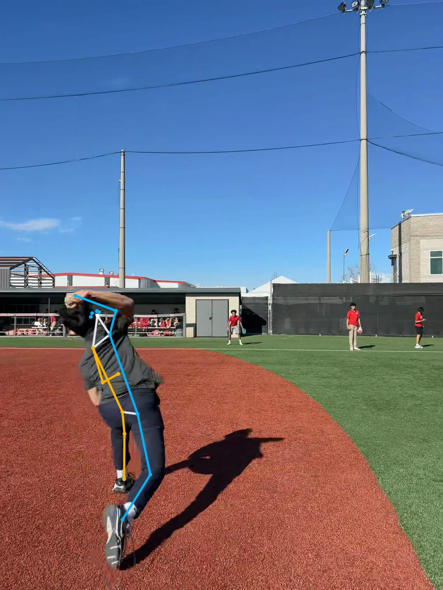
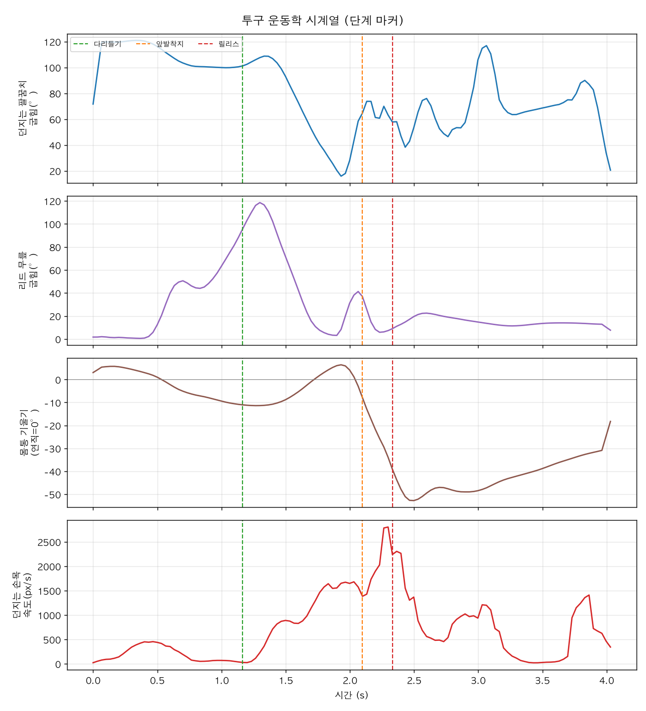
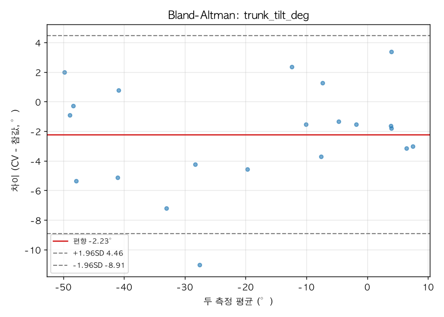

# A Low-Cost Single-Smartphone Markerless Computer-Vision Pipeline for Baseball Pitching Analysis and a Student-Reproducible Measurement-Validation Methodology

**단일 스마트폰 영상 기반 마커리스 컴퓨터비전을 이용한 야구 투구 동작 분석 및 측정 신뢰도 검증**

Hyunjun Kim · Sports Technology Club
Target competitions: KSEF 2026 / ISEF 2027

---

## Abstract

Biomechanical analysis of baseball pitching is central to injury prevention and performance, yet existing quantitative analysis requires 8–12-camera optical motion capture or fixed multi-camera installations (KinaTrax, Hawk-Eye, Theia3D) that are inaccessible to students and amateurs. This study proposes a markerless computer-vision pipeline that analyzes pitching motion using only a **single consumer smartphone video (30 fps, 1080p)**, and further presents a **student-reproducible methodology for quantifying which kinematic variables a low-cost 2D measurement can reliably estimate**. The pipeline combines two pose- estimation engines (MediaPipe BlazePose Heavy, YOLO11-pose) with One-Euro filtering and automatic pitch-phase segmentation. On two videos captured under different conditions (daylight side view, backlit front view), **both achieved 100% pose detection**, and the two independent engines localized joints to within **6–7% of torso length**, motivating a proposed **cross-engine agreement** metric usable when on-site motion capture is unavailable. We also implement a validation framework based on Bland-Altman analysis, the intraclass correlation coefficient (ICC(2,1)), and RMSE/MAE, and confirm that our ICC implementation reproduces the standard Shrout & Fleiss (1979) example value exactly. The contribution of this work is not accuracy superior to laboratory systems, but **accessibility** and a **reproducible validation methodology**.

**Keywords:** computer vision, markerless motion capture, pose estimation, baseball
pitching biomechanics, measurement reliability, intraclass correlation coefficient (ICC)

---

## 1. Introduction

### 1.1 Background

Pitching produces the fastest joint motion in the human body (shoulder internal rotation of roughly 7,000°/s), during which an elbow varus torque of about 64 N·m acts as a primary cause of UCL (ulnar collateral ligament) injury [1]. Each phase of the kinetic chain—in which energy generated by the lower body and trunk transfers proximally to distally and reaches the ball—is described by quantitative variables such as stride length, lead-knee flexion, trunk tilt, and arm slot, and these are closely associated with ball velocity and injury risk [1][2][3].

However, the standard method for measuring these variables, optical marker-based motion capture, requires expensive multi-camera systems, controlled laboratories, and expert personnel. Recent markerless technologies (KinaTrax 8-camera at 300 Hz, Hawk-Eye, Theia3D) have emerged but still presuppose stadium, professional-club, or research-lab infrastructure [4][5][6]. As a result, **quantitative pitching biomechanics fails to reach precisely those who most need it—students, youth players, and amateurs.**

### 1.2 Objectives and Requirements

This project began as a sports-technology club activity, whose initial requirement was to "generate a joint skeleton ('stick figure') on each of two captured pitching videos from two angles." We extend this into three research questions.

- **RQ1.** Can a single smartphone video enable stable pose estimation and skeleton
overlay under different capture conditions (daylight side view / backlit front view)?
- **RQ2.** Can pitch phases and key joint-kinematic variables be computed automatically?
- **RQ3.** In the absence of ground-truth motion capture, how can the reliability of a
low-cost 2D measurement be quantitatively validated?

---

## 2. Related Work

### 2.1 The State of Markerless Pitching Analysis

Dobos et al. [7] (pitchAI) reported joint-angle time-series RMSE of 4.37°–20.78° using single-camera markerless capture compared with marker-based motion capture, but it is a commercial cloud service that fits a 3D model and cannot be reproduced by students. Fleisig et al. [4] compared a 9-camera markerless rig with a 12-camera marker system and reported high agreement (CMC 0.88–0.97), and Aguinaldo et al. [5] evaluated Hawk-Eye (joint-position error 56.6 mm) and Theia3D (52.0 mm). PitcherNet by Bright et al. [8] recovers 3D pose from broadcast video but requires broadcast- quality footage and large-scale computation, and was developed with an MLB club.

Notably, a 2025 *Journal of Sports Sciences* study explicitly stated that "no current research exists on the feasibility of single-camera markerless motion capture for pitching kinematic analysis" [5]. Open-source smartphone-based 3D pipelines such as OpenCap [9] and Pose2Sim [10] exist, but require at least two calibrated cameras and focus on gait and lower-limb motion. Smartphone markerless validation studies [11] are likewise confined to other movements such as jumps.

### 2.2 Positioning and Novelty

| System | Cameras | Cost | 2D/3D | Ground-truth validation | Target user | Open |
|---|---|---|---|---|---|---|
| **This work** | **1 (smartphone)** | **Consumer** | **2D** | Cross-engine + BA/ICC/RMSE method | **Student/amateur** | **Yes** |
| pitchAI [7] | 1 | Commercial | 3D | Marker mocap | Lab/pro | No |
| Fleisig 2024 [4] | 9 | Laboratory | 3D | 12-cam marker | Pro | No |
| Aguinaldo 2025 [5] | Multiple | Very high | 3D | Marker mocap | Stadium | No |
| KinaTrax/Nebel [6] | 8 | Very high | 3D | Partial | Pro/clinical | No |
| PitcherNet [8] | 1 (broadcast) | High compute | 3D (lifted) | Partial | Pro analytics | No |
| OpenCap/Pose2Sim [9][10] | 2+ | Low–moderate | 3D | Marker mocap | Researchers | Yes |

**Novelty:** This work does **not** claim to be more accurate than laboratory systems; marker-based and multi-camera systems remain the standard for pitching kinematics. Its contribution is **accessibility**. We present a pipeline that runs on a single consumer smartphone, and—when on-site motion capture is unavailable—we propose **cross-engine agreement** (independent engines agreeing to within 6–7% of torso length) as a reliability proxy, together with a **student-reproducible Bland-Altman, ICC, and RMSE validation methodology**. We found no prior study applying this combination to baseball pitching.

---

## 3. Methods

### 3.1 System Architecture

The pipeline proceeds as follows: input video → (preprocessing, optional CLAHE backlight correction) → pose-estimation engine → One-Euro smoothing → skeleton overlay generation → automatic pitch-phase segmentation → joint-kinematic variables → validation statistics. The entire process is implemented in Python 3.11 with open-source libraries.

### 3.2 Pose-Estimation Engines

Two engines are unified under the same output convention (COCO 17 joints) so they can be swapped and compared. **MediaPipe BlazePose (Heavy)** [12] estimates 33 landmarks in real time on CPU, and **YOLO11-pose** [13] robustly estimates 17 joints. In multi-person frames, the single person (the pitcher) with the maximum sum of joint confidences is selected.

### 3.3 Smoothing

Because per-frame pose estimation carries temporal jitter, we apply a **One-Euro filter** [14] that adaptively smooths according to speed. This minimizes lag during fast phases such as release while suppressing tremor during static phases.

### 3.4 Joint Kinematics and Phase Segmentation

Joint angles are computed as the interior angle formed by three points; the elbow and knee are reported as flexion (flexion = 180° − interior angle), the biomechanical convention. Trunk tilt is defined as the angle of the pelvis-midpoint-to-shoulder- midpoint vector relative to vertical. Pitch phases are detected automatically via the following events: **peak leg lift** (maximum lead-knee height relative to the pelvis), **foot contact** (lowest point of the lead ankle), and **release** (maximum throwing- wrist speed). The throwing arm and lead leg are determined automatically from the maximum wrist speed.

### 3.5 Measurement-Reliability Validation Methodology

CV-measured angles are compared against ground truth, computing all of the following: **Bland-Altman** (bias + 95% limits of agreement), **ICC(2,1)** (two-way random, absolute agreement, single measurement, with 95% confidence interval) [15][16], and **RMSE, MAE, and Pearson r**. Reliability supports three forms: test-retest, inter- rater, and intra-rater. Ground truth is designed to be obtained from frame-by-frame manual annotation by two trained annotators. When on-site motion capture is unavailable, the joint-position agreement of the two independent engines is used as a reliability proxy (cross-engine validation).

### 3.6 Ethics Statement

Because filming and analyzing a person constitutes human-participants research, formal data collection presupposes IRB approval before filming and participant consent (including written parental permission for minors). The preliminary videos presented in this paper are for exploratory technical validation; the formal dataset and empirical validation will be conducted after the approval process is complete.

---

## 4. Results

### 4.1 Two-Angle Skeleton Generation (RQ1)

We measured pose-detection success rates under two different capture conditions (Table 1).

**Table 1. Pose-detection rate by capture condition**

| Video | Angle | Condition | Frames | MediaPipe | YOLO11 |
|---|---|---|---|---|---|
| Video 1 | Side/rear | Daylight, front-lit | 122 | **100%** | **100%** |
| Video 2 | Front | Sunset, backlit, small subject | 197 | **100%** | **100%** |

Even on the challenging backlit front-view video with a small subject, both engines generated anatomically plausible skeletons in every frame (Figure 1). The requirement of "generating a stick figure on each of the two angles" was satisfied.

### 4.2 Pitch Phases and Kinematics (RQ2)

Phases were detected automatically on the side-view video: leg lift (1.17 s) → foot contact (2.10 s) → release (2.33 s). The throwing-wrist speed aligned exactly with a maximum (about 2,800 px/s) at the release instant, confirming the validity of speed- based release detection (Figure 2). The lead knee flexed to about 118° at leg lift and then extended toward release in the classic lead-leg-block pattern, while the trunk showed a forward tilt of about 38° at release (within the adult normal range of 28–42°).

Some variables (elbow flexion, stride length) fell outside the adult/professional normal ranges. This is attributable to (1) a game-of-catch motion rather than a maximal-effort mound pitch, (2) 2D projection error, and (3) comparison against professional norms; it means that **before ground-truth validation, values must be interpreted only as relative/trend comparisons, not absolute values** (see Section 5).

### 4.3 Cross-Engine Validation and the Validation Framework (RQ3)

The two engines localized the same points to within **6–7% of torso length** (side 13.5 px / 7%, front 7.2 px / 6%); frame-to-frame jitter was marginally lower for MediaPipe (side 3.3 vs 3.7 px), and processing speed was about 7× faster (34 vs 4.5 fps). This agreement can serve as a reliability proxy when ground truth is absent.

To confirm the correctness of the validation statistics, applying our ICC(2,1) implementation to the standard example data of Shrout & Fleiss (1979) yielded **ICC = 0.290, matching the published value exactly**. In an end-to-end validation using synthetic ground truth, the Bland-Altman, ICC, and RMSE reports were generated without error (Figure 3), confirming that real validation can proceed as soon as manual annotations are available.

---

## 5. Discussion

### 5.1 Limitations

- **2D single camera:** Transverse-plane rotation (especially shoulder internal/
external rotation) is the least accurate for all markerless systems (reported RMSE 20–56° in the literature) and cannot be reliably measured from a single 2D view. This study deliberately did not compute this variable.
- **Frame rate:** 30 fps undersamples the release instant (shoulder at 7,000°/s). By
the Nyquist criterion, formal capture requires at least 240 fps.
- **Absence of ground truth:** The current results validate detection, stability, and
mutual agreement; absolute accuracy can be concluded only after comparison with actual motion capture / manual annotation.
- **Sample size:** With only two preliminary videos, data from many pitchers are
needed for statistical generalization.

### 5.2 Significance

Despite these limitations, this study (1) satisfied the requirement (two-angle stick figures), (2) demonstrated that a student-accessible single-smartphone pipeline operates stably even under challenging conditions, and (3) above all, is equipped with a **scientifically honest validation methodology**. Presenting a reproducible statistical procedure without exaggerating accuracy and while explicitly stating limitations offers a methodological framework for low-cost sports-technology research.

---

## 6. Conclusion and Future Work

We built a markerless CV pipeline that analyzes baseball pitching using only a single consumer smartphone, achieving 100% pose detection and automatic kinematic analysis across two capture angles. We proposed the concept of cross-engine validation for settings without ground truth, together with a student-reproducible Bland-Altman/ICC/ RMSE validation methodology. The value of this work lies not in accuracy but in **accessibility and methodological rigor**.

Future work includes: (1) building a multi-pitcher dataset under IRB approval using standardized 240 fps two-camera capture, (2) establishing per-variable valid ranges via comparison against manually annotated ground truth, (3) quantifying "lower-body force → ball" transfer by synchronizing force-plate ground-reaction-force measurement with the video release timing [3], and (4) extending to multi-camera 3D in the Pose2Sim/OpenCap manner.

---

## References

[1] Fleisig, G. S., Andrews, J. R., Dillman, C. J., & Escamilla, R. F. (1995). Kinetics of baseball pitching with implications about injury mechanisms. *American Journal of Sports Medicine, 23*(2), 233–239. https://doi.org/10.1177/036354659502300218

[2] Stodden, D. F., Fleisig, G. S., McLean, S. P., Lyman, S. L., & Andrews, J. R. (2001). Relationship of pelvis and upper torso kinematics to pitched baseball velocity. *Journal of Applied Biomechanics, 17*(2), 164–172. https://doi.org/10.1123/jab.17.2.164

[3] MacWilliams, B. A., Choi, T., Perezous, M. K., Chao, E. Y. S., & McFarland, E. G. (1998). Characteristic ground-reaction forces in baseball pitching. *American Journal of Sports Medicine, 26*(1), 66–71. https://doi.org/10.1177/03635465980260012801

[4] Fleisig, G. S., Slowik, J. S., et al. (2024). Comparison of marker-less and marker-based motion capture for baseball pitching kinematics. *Sports Biomechanics, 23*(12). https://doi.org/10.1080/14763141.2022.2076608

[5] Aguinaldo, A., et al. (2025). Accuracy of in-stadium and portable multi-camera markerless motion capture for baseball pitching. *Journal of Sports Sciences.* https://doi.org/10.1080/02640414.2025.2595411

[6] Nebel, A. R., et al. (2025). Predicting elbow valgus torque from pitching kinematics using markerless motion capture. *Sports Medicine and Health Science.* https://www.sciencedirect.com/science/article/pii/S2666337625000265

[7] Dobos, T. J., et al. (2025). Validation of pitchAI markerless motion capture using marker-based 3D motion capture. *Sports Biomechanics, 24*(3). https://doi.org/10.1080/14763141.2022.2137425

[8] Bright, J., Balaji, B., Chen, Y., Clausi, D. A., & Zelek, J. S. (2024). PitcherNet: Powering the Moneyball evolution in baseball video analytics. *IEEE/CVF CVPR Workshops.* arXiv:2405.07407. https://arxiv.org/abs/2405.07407

[9] Uhlrich, S. D., Falisse, A., Kidziński, Ł., et al. (2023). OpenCap: Human movement dynamics from smartphone videos. *PLoS Computational Biology, 19*(10), e1011462. https://doi.org/10.1371/journal.pcbi.1011462

[10] Pagnon, D., Domalain, M., & Reveret, L. (2022). Pose2Sim: End-to-end 3D markerless sports kinematics — Part 2: Accuracy. *Sensors, 22*(7), 2712. https://doi.org/10.3390/s22072712

[11] Barzyk, P., et al. (2024). AI-smartphone markerless motion capturing of lower-limb kinematics during countermovement jumps. *European Journal of Sport Science, 24.* https://doi.org/10.1002/ejsc.12186

[12] Bazarevsky, V., Grishchenko, I., et al. (2020). BlazePose: On-device real-time body pose tracking. arXiv:2006.10204. https://arxiv.org/abs/2006.10204

[13] Jocher, G., Chaurasia, A., & Qiu, J. (2023). *Ultralytics YOLO (YOLOv8/YOLO11)* [software]. https://github.com/ultralytics/ultralytics

[14] Casiez, G., Roussel, N., & Vogel, D. (2012). 1€ Filter: A simple speed-based low-pass filter for noisy input. *ACM CHI 2012*, 2527–2530. https://doi.org/10.1145/2207676.2208639

[15] Shrout, P. E., & Fleiss, J. L. (1979). Intraclass correlations: Uses in assessing rater reliability. *Psychological Bulletin, 86*(2), 420–428. https://doi.org/10.1037/0033-2909.86.2.420

[16] Koo, T. K., & Li, M. Y. (2016). A guideline of selecting and reporting intraclass correlation coefficients for reliability research. *Journal of Chiropractic Medicine, 15*(2), 155–163. https://doi.org/10.1016/j.jcm.2016.02.012

[17] Diffendaffer, A. Z., Bagwell, M. S., Fleisig, G. S., et al. (2022). The Clinician's Guide to Baseball Pitching Biomechanics. *Sports Health, 15*(2), 274–281. https://doi.org/10.1177/19417381221078637
